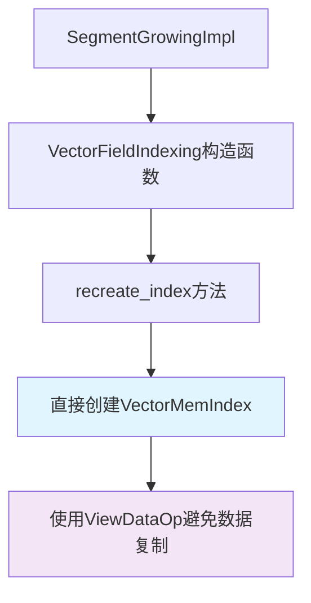
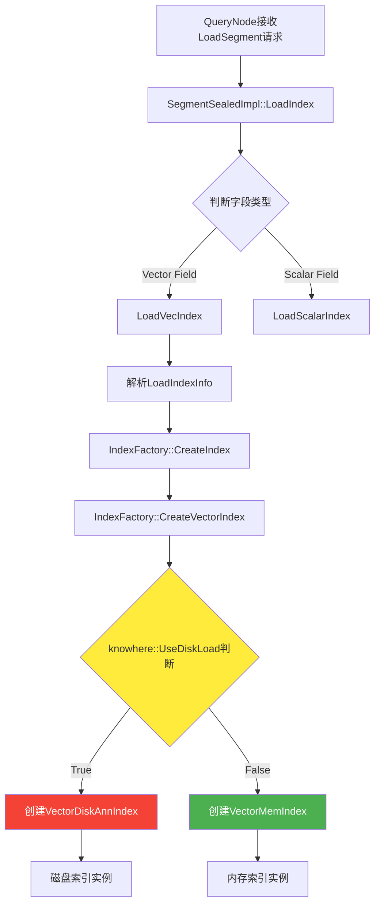
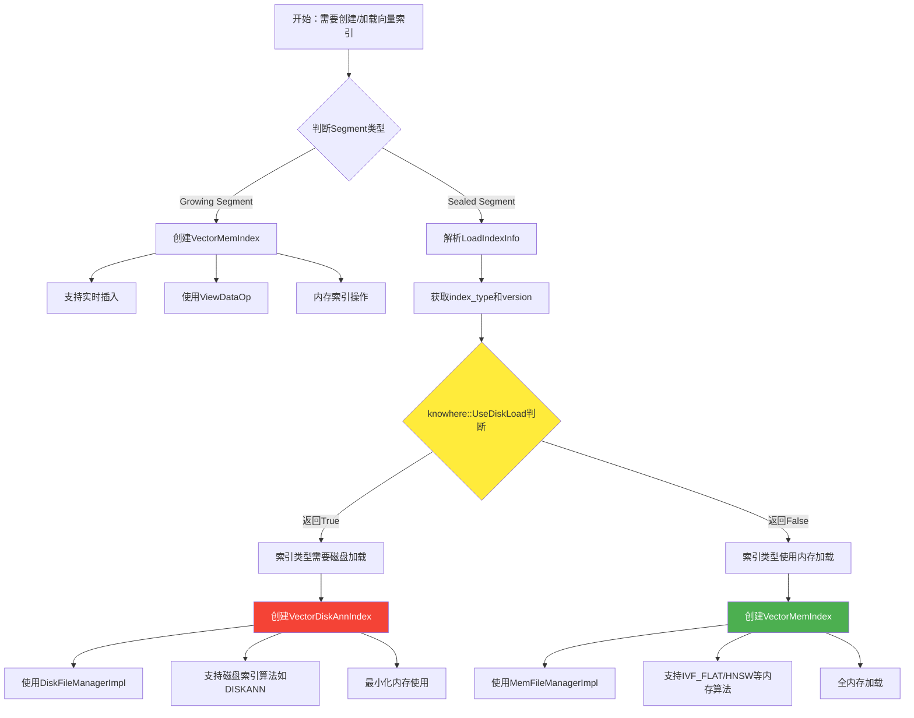

# Milvus 索引选择决策流程分析

## 1. 概述

在 Milvus 的 Segcore 层面，系统会根据多种因素自动选择使用 `VectorMemIndex`（内存索引）还是 `VectorDiskAnnIndex`（磁盘索引）。本文档详细分析了这个决策过程的完整流程。

## 2. 核心决策点

### 2.1 主要判断逻辑

索引选择的核心判断位于 `IndexFactory::CreateVectorIndex()` 方法中：

```cpp
// IndexFactory.cpp:CreateVectorIndex()
IndexBasePtr IndexFactory::CreateVectorIndex(
    const CreateIndexInfo& create_index_info,
    const storage::FileManagerContext& file_manager_context,
    bool use_knowhere_build_pool) {
    
    auto index_type = create_index_info.index_type;
    auto metric_type = create_index_info.metric_type;
    auto version = create_index_info.index_engine_version;
    auto data_type = create_index_info.field_type;
    
    // 核心判断：是否使用磁盘加载
    if (knowhere::UseDiskLoad(index_type, version)) {
        // 创建 VectorDiskAnnIndex
        switch (data_type) {
            case DataType::VECTOR_FLOAT:
                return std::make_unique<VectorDiskAnnIndex<float>>(
                    index_type, metric_type, version, file_manager_context);
            // ... 其他数据类型
        }
    } else {
        // 创建 VectorMemIndex
        switch (data_type) {
            case DataType::VECTOR_FLOAT:
                return std::make_unique<VectorMemIndex<float>>(
                    index_type, metric_type, version, 
                    use_knowhere_build_pool, file_manager_context);
            // ... 其他数据类型
        }
    }
}
```

### 2.2 `knowhere::UseDiskLoad()` 函数

这个函数是决策的关键，它根据以下参数判断：
- **index_type**: 索引类型（如 DISKANN, IVF_FLAT, HNSW 等）
- **version**: 索引引擎版本号

```cpp
// load_index_c.cpp
bool IsLoadWithDisk(const char* index_type, int index_engine_version) {
    return knowhere::UseDiskLoad(index_type, index_engine_version) ||
           strcmp(index_type, milvus::index::INVERTED_INDEX_TYPE) == 0;
}
```

## 3. 索引创建的触发路径

### 3.1 路径一：Growing Segment 索引创建



**代码路径**：
```cpp
// FieldIndexing.cpp:VectorFieldIndexing构造函数
VectorFieldIndexing::VectorFieldIndexing(...) {
    recreate_index(field_meta.get_data_type(), field_raw_data);
}

void VectorFieldIndexing::recreate_index(DataType data_type,
                                         const VectorBase* field_raw_data) {
    // Growing Segment 总是使用 VectorMemIndex
    if (data_type == DataType::VECTOR_FLOAT) {
        knowhere::ViewDataOp view_data = [field_raw_data_ptr](size_t id) {
            return (const void*)field_raw_data_ptr->get_element(id);
        };
        index_ = std::make_unique<index::VectorMemIndex<float>>(
            config_->GetIndexType(),
            config_->GetMetricType(),
            knowhere::Version::GetCurrentVersion().VersionNumber(),
            false,
            view_data);
    }
    // ... 其他数据类型
}
```

**特点**：
- Growing Segment **总是**使用 VectorMemIndex
- 支持实时数据插入（AddWithDataset）
- 使用 ViewDataOp 机制直接引用原始数据，避免复制

### 3.2 路径二：Sealed Segment 索引加载



**代码路径**：
```cpp
// SegmentSealedImpl.cpp
void SegmentSealedImpl::LoadIndex(const LoadIndexInfo& info) {
    auto field_id = FieldId(info.field_id);
    auto& field_meta = schema_->operator[](field_id);
    if (field_meta.is_vector()) {
        LoadVecIndex(info);  // 加载向量索引
    } else {
        LoadScalarIndex(info);  // 加载标量索引
    }
}

void SegmentSealedImpl::LoadVecIndex(const LoadIndexInfo& info) {
    // 通过IndexFactory创建索引
    // 索引类型在这里已经确定，来自于info.index_params
}
```

## 4. 决策参数分析

### 4.1 关键配置参数

影响索引选择的关键参数包括：

| 参数名称 | 来源 | 作用 | 示例值 |
|---------|------|------|--------|
| **index_type** | 用户创建索引时指定 | 决定索引算法类型 | "DISKANN", "IVF_FLAT", "HNSW" |
| **index_engine_version** | 系统配置 | 索引引擎版本 | 当前版本号 |
| **field_type** | Schema定义 | 字段数据类型 | VECTOR_FLOAT, VECTOR_BINARY |
| **metric_type** | 用户指定 | 距离度量类型 | "L2", "IP", "COSINE" |
| **enable_mmap** | 系统配置 | 是否启用内存映射 | true/false |

### 4.2 LoadIndexInfo 结构

```cpp
// LoadIndexInfo 包含的关键信息
struct LoadIndexInfo {
    int64_t segment_id;
    int64_t field_id;
    DataType field_type;
    std::map<std::string, std::string> index_params;  // 包含index_type等
    std::vector<std::string> index_files;
    int64_t index_build_id;
    IndexVersion index_engine_version;
    bool enable_mmap;
    std::string mmap_dir_path;
    float index_size;
};
```

## 5. 完整决策流程图



## 6. 不同索引类型的典型决策

### 6.1 常见索引类型及其选择

| 索引类型 | 通常选择的实现 | 原因 | 适用场景 |
|---------|---------------|------|----------|
| **DISKANN** | VectorDiskAnnIndex | 专门的磁盘索引算法 | 大规模数据，内存有限 |
| **IVF_FLAT** | VectorMemIndex | 经典内存算法 | 中小规模数据，高精度需求 |
| **IVF_PQ** | VectorMemIndex | 压缩的内存算法 | 平衡内存和精度 |
| **HNSW** | VectorMemIndex | 高效内存图算法 | 高性能查询需求 |
| **FLAT** | VectorMemIndex | 暴力搜索 | 小数据集，最高精度 |

### 6.2 决策逻辑示例

```cpp
// 伪代码示例
std::string determineIndexChoice(const std::string& index_type, 
                                int version,
                                SegmentType segment_type) {
    if (segment_type == SegmentType::Growing) {
        return "VectorMemIndex";  // Growing总是内存索引
    }
    
    if (index_type == "DISKANN") {
        return "VectorDiskAnnIndex";  // DISKANN使用磁盘索引
    }
    
    if (knowhere::UseDiskLoad(index_type, version)) {
        return "VectorDiskAnnIndex";
    }
    
    return "VectorMemIndex";  // 默认使用内存索引
}
```

## 7. 性能和资源考量

### 7.1 VectorMemIndex 选择场景

```cpp
// 适用条件
bool shouldUseMemIndex(const IndexCreationContext& ctx) {
    return ctx.segment_type == Growing ||           // Growing Segment
           ctx.data_size < memory_threshold ||      // 数据量小
           ctx.qps_requirement > high_qps_threshold || // 高QPS需求
           ctx.latency_requirement < low_latency_threshold || // 低延迟需求
           !knowhere::UseDiskLoad(ctx.index_type, ctx.version);
}
```

**特点**：
- 低延迟（纳秒级响应）
- 高QPS支持
- 支持实时更新
- 内存消耗大

### 7.2 VectorDiskAnnIndex 选择场景

```cpp
// 适用条件  
bool shouldUseDiskIndex(const IndexCreationContext& ctx) {
    return ctx.segment_type == Sealed &&           // 仅Sealed Segment
           ctx.data_size > large_data_threshold &&  // 大数据量
           ctx.memory_budget < required_memory &&   // 内存预算有限
           knowhere::UseDiskLoad(ctx.index_type, ctx.version); // 支持磁盘加载
}
```

**特点**：
- 低内存消耗
- 支持超大规模数据
- 较高延迟（毫秒级）
- 不支持实时更新

## 8. 代码调用链追踪

### 8.1 Growing Segment 索引创建调用链

```
SegmentGrowingImpl::构造函数
  └── VectorFieldIndexing::VectorFieldIndexing()
      └── recreate_index(field_meta.get_data_type(), field_raw_data)
          └── std::make_unique<VectorMemIndex<T>>(...)
              └── VectorMemIndex::VectorMemIndex(view_data构造函数)
```

### 8.2 Sealed Segment 索引加载调用链

```
QueryNode::LoadSegment
  └── SegmentSealedImpl::LoadIndex(LoadIndexInfo)
      └── LoadVecIndex(info)
          └── IndexFactory::GetInstance().CreateIndex(index_info, context)
              └── IndexFactory::CreateVectorIndex(...)
                  └── knowhere::UseDiskLoad(index_type, version)
                      ├── True  → std::make_unique<VectorDiskAnnIndex<T>>(...)
                      └── False → std::make_unique<VectorMemIndex<T>>(...)
```

## 9. 配置和调优建议

### 9.1 索引类型选择指导

```yaml
# 推荐配置
index_configurations:
  small_dataset:  # < 100万向量
    index_type: "IVF_FLAT"
    result: "VectorMemIndex"
    
  medium_dataset:  # 100万-1000万向量
    index_type: "IVF_PQ" 
    result: "VectorMemIndex"
    
  large_dataset:  # > 1000万向量
    index_type: "DISKANN"
    result: "VectorDiskAnnIndex"
    
  realtime_updates:  # 需要实时更新
    segment_type: "Growing"
    result: "VectorMemIndex (强制)"
```

### 9.2 资源规划建议

| 场景 | 推荐索引 | 内存规划 | 存储规划 |
|------|---------|----------|----------|
| 低延迟查询 | VectorMemIndex | 向量数据量 × 1.5 | SSD推荐 |
| 大规模存储 | VectorDiskAnnIndex | 基础内存 + 缓存 | 高IOPS存储 |
| 实时写入 | VectorMemIndex | 充足内存预留 | 快速存储 |
| 成本优化 | VectorDiskAnnIndex | 最小内存配置 | 大容量存储 |

## 10. 调试和监控

### 10.1 日志追踪

关键日志信息：
```cpp
LOG_INFO("Creating vector index: type={}, version={}, segment_type={}", 
         index_type, version, segment_type);

LOG_INFO("UseDiskLoad result: {}, chosen implementation: {}", 
         use_disk_load, chosen_index_type);
```

### 10.2 性能监控指标

- **索引创建时间**：区分内存vs磁盘索引构建耗时
- **内存使用量**：监控不同索引类型的内存占用
- **查询延迟**：对比内存索引和磁盘索引的查询性能
- **磁盘I/O**：磁盘索引的存储访问模式

## 11. 总结

Milvus 的索引选择机制是一个多层次的决策系统：

1. **Segment类型**是第一层决策：Growing Segment 强制使用内存索引
2. **索引算法类型**是第二层决策：通过 `knowhere::UseDiskLoad()` 判断
3. **系统配置**是第三层决策：版本、MMAP等参数影响
4. **资源约束**是第四层考量：内存、存储、性能需求

这种设计使得 Milvus 能够在不同场景下自动选择最合适的索引实现，在性能、资源使用和成本之间找到最佳平衡点。理解这个流程对于优化 Milvus 部署和调优具有重要意义。