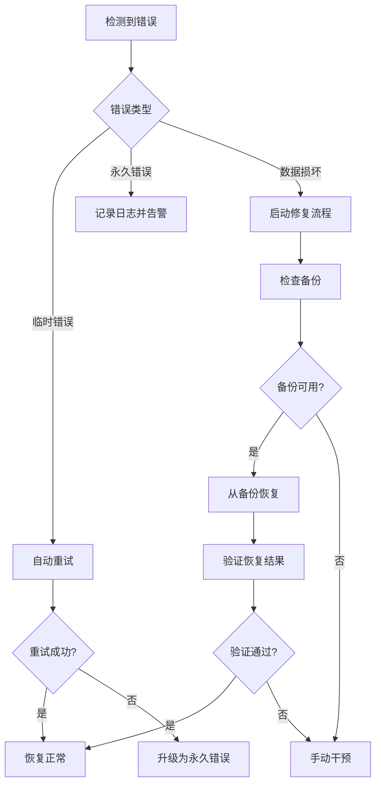

# Milvus StorageV2 错误处理与异常恢复

## 1. 概述

StorageV2 的错误处理和异常恢复机制设计了多层次的容错策略，包括预防性检查、优雅降级、自动恢复和手动干预等手段。整个系统通过完善的错误分类、状态管理和恢复机制，确保数据的完整性和系统的高可用性。

## 2. 错误处理架构

### 2.1 错误分层架构

```
┌─────────────────────────────────────────────────────┐
│                   Application Layer                │
│              (Business Logic Errors)              │
├─────────────────────────────────────────────────────┤
│                   Service Layer                    │
│  ┌─────────────────┐    ┌─────────────────────────┐  │
│  │   Retry Logic   │    │   Circuit Breaker      │  │
│  │   Timeout       │    │   Fallback Strategy    │  │
│  └─────────────────┘    └─────────────────────────┘  │
├─────────────────────────────────────────────────────┤
│                   Storage Layer                    │
│  ┌─────────────────┐    ┌─────────────────────────┐  │
│  │  I/O Errors     │    │   Corruption Detection │  │
│  │  Format Errors  │    │   Integrity Check      │  │
│  └─────────────────┘    └─────────────────────────┘  │
├─────────────────────────────────────────────────────┤
│                 Infrastructure Layer               │
│  ┌─────────────────┐    ┌─────────────────────────┐  │
│  │ Network Errors  │    │   Hardware Failures    │  │
│  │ Disk Errors     │    │   Resource Exhaustion  │  │
│  └─────────────────┘    └─────────────────────────┘  │
└─────────────────────────────────────────────────────┘
```

### 2.2 错误分类体系

#### 2.2.1 错误类型定义
```go
type ErrorType int

const (
    // 临时错误 - 可重试
    ErrorTypeTemporary ErrorType = iota
    
    // 永久错误 - 不可重试
    ErrorTypePermanent
    
    // 数据损坏 - 需恢复
    ErrorTypeCorruption
    
    // 资源不足 - 需等待
    ErrorTypeResourceExhausted
    
    // 配置错误 - 需修复
    ErrorTypeConfiguration
    
    // 网络错误 - 可重试
    ErrorTypeNetwork
    
    // 权限错误 - 需授权
    ErrorTypePermission
)

type StorageError struct {
    Type      ErrorType
    Code      int
    Message   string
    Cause     error
    Context   map[string]interface{}
    Timestamp time.Time
    Retryable bool
}
```

#### 2.2.2 错误创建函数
```go
func NewStorageError(errType ErrorType, code int, message string, cause error) *StorageError {
    return &StorageError{
        Type:      errType,
        Code:      code,
        Message:   message,
        Cause:     cause,
        Context:   make(map[string]interface{}),
        Timestamp: time.Now(),
        Retryable: isRetryable(errType),
    }
}

func (e *StorageError) Error() string {
    return fmt.Sprintf("[%s] %s: %s", e.Type, e.Message, e.Cause)
}

func (e *StorageError) WithContext(key string, value interface{}) *StorageError {
    e.Context[key] = value
    return e
}

func isRetryable(errType ErrorType) bool {
    switch errType {
    case ErrorTypeTemporary, ErrorTypeNetwork, ErrorTypeResourceExhausted:
        return true
    default:
        return false
    }
}
```

## 3. 预防性错误检查

### 3.1 数据完整性检查

#### 3.1.1 校验和验证
```go
type ChecksumValidator struct {
    algorithm string // CRC32, MD5, SHA256
}

func (cv *ChecksumValidator) ComputeChecksum(data []byte) string {
    switch cv.algorithm {
    case "CRC32":
        return fmt.Sprintf("%08x", crc32.ChecksumIEEE(data))
    case "MD5":
        hash := md5.Sum(data)
        return fmt.Sprintf("%x", hash)
    case "SHA256":
        hash := sha256.Sum256(data)
        return fmt.Sprintf("%x", hash)
    default:
        return ""
    }
}

func (cv *ChecksumValidator) ValidateData(data []byte, expectedChecksum string) error {
    actualChecksum := cv.ComputeChecksum(data)
    if actualChecksum != expectedChecksum {
        return NewStorageError(
            ErrorTypeCorruption,
            1001,
            "data corruption detected",
            fmt.Errorf("checksum mismatch: expected %s, got %s", 
                      expectedChecksum, actualChecksum))
    }
    return nil
}
```

#### 3.1.2 格式验证
```go
type FormatValidator struct {
    schema *arrow.Schema
}

func (fv *FormatValidator) ValidateArrowRecord(record arrow.Record) error {
    // 1. 检查列数
    if record.NumCols() != int64(fv.schema.NumFields()) {
        return NewStorageError(
            ErrorTypePermanent,
            1002,
            "column count mismatch",
            fmt.Errorf("expected %d columns, got %d", 
                      fv.schema.NumFields(), record.NumCols()))
    }
    
    // 2. 检查数据类型
    for i, field := range fv.schema.Fields() {
        col := record.Column(i)
        if !arrow.TypeEqual(col.DataType(), field.Type) {
            return NewStorageError(
                ErrorTypePermanent,
                1003,
                "data type mismatch",
                fmt.Errorf("column %d: expected %s, got %s", 
                          i, field.Type, col.DataType()))
        }
    }
    
    // 3. 检查数据范围
    return fv.validateDataRanges(record)
}

func (fv *FormatValidator) validateDataRanges(record arrow.Record) error {
    for i, col := range record.Columns() {
        switch arr := col.(type) {
        case *array.Int64:
            for j := 0; j < arr.Len(); j++ {
                if !arr.IsNull(j) {
                    val := arr.Value(j)
                    if val < math.MinInt32 || val > math.MaxInt32 {
                        return NewStorageError(
                            ErrorTypeCorruption,
                            1004,
                            "value out of range",
                            fmt.Errorf("column %d, row %d: value %d out of range", 
                                      i, j, val))
                    }
                }
            }
        // ... 其他类型检查
        }
    }
    return nil
}
```

### 3.2 资源可用性检查

#### 3.2.1 磁盘空间检查
```go
type ResourceChecker struct {
    minDiskSpace int64
    minMemory    int64
}

func (rc *ResourceChecker) CheckDiskSpace(path string, requiredSpace int64) error {
    var stat syscall.Statfs_t
    if err := syscall.Statfs(path, &stat); err != nil {
        return NewStorageError(
            ErrorTypeTemporary,
            2001,
            "failed to check disk space",
            err)
    }
    
    availableSpace := int64(stat.Bavail) * int64(stat.Bsize)
    if availableSpace < requiredSpace+rc.minDiskSpace {
        return NewStorageError(
            ErrorTypeResourceExhausted,
            2002,
            "insufficient disk space",
            fmt.Errorf("required %d bytes, available %d bytes", 
                      requiredSpace, availableSpace))
    }
    
    return nil
}

func (rc *ResourceChecker) CheckMemory(requiredMemory int64) error {
    var m runtime.MemStats
    runtime.ReadMemStats(&m)
    
    availableMemory := int64(m.Sys - m.HeapInuse)
    if availableMemory < requiredMemory+rc.minMemory {
        return NewStorageError(
            ErrorTypeResourceExhausted,
            2003,
            "insufficient memory",
            fmt.Errorf("required %d bytes, available %d bytes", 
                      requiredMemory, availableMemory))
    }
    
    return nil
}
```

#### 3.2.2 网络连接检查
```go
type ConnectivityChecker struct {
    timeout time.Duration
}

func (cc *ConnectivityChecker) CheckStorageConnection(config *StorageConfig) error {
    ctx, cancel := context.WithTimeout(context.Background(), cc.timeout)
    defer cancel()
    
    switch config.StorageType {
    case "minio":
        return cc.checkMinIOConnection(ctx, config)
    case "azure":
        return cc.checkAzureConnection(ctx, config)
    case "gcp":
        return cc.checkGCPConnection(ctx, config)
    default:
        return nil // 本地存储无需检查
    }
}

func (cc *ConnectivityChecker) checkMinIOConnection(ctx context.Context, config *StorageConfig) error {
    client, err := minio.New(config.Address, &minio.Options{
        Creds:  credentials.NewStaticV4(config.AccessKeyID, config.SecretAccessKey, ""),
        Secure: config.UseSSL,
    })
    if err != nil {
        return NewStorageError(
            ErrorTypeConfiguration,
            3001,
            "failed to create MinIO client",
            err)
    }
    
    // 测试连接
    _, err = client.ListBuckets(ctx)
    if err != nil {
        return NewStorageError(
            ErrorTypeNetwork,
            3002,
            "MinIO connection failed",
            err)
    }
    
    return nil
}
```

## 4. 重试机制

### 4.1 指数退避重试

#### 4.1.1 重试策略
```go
type RetryPolicy struct {
    MaxAttempts     int
    InitialDelay    time.Duration
    MaxDelay        time.Duration
    BackoffMultiplier float64
    JitterPercent   float64
}

type RetryExecutor struct {
    policy RetryPolicy
    logger *log.Logger
}

func (re *RetryExecutor) Execute(ctx context.Context, operation func() error) error {
    var lastErr error
    delay := re.policy.InitialDelay
    
    for attempt := 1; attempt <= re.policy.MaxAttempts; attempt++ {
        // 执行操作
        if err := operation(); err != nil {
            lastErr = err
            
            // 检查是否可重试
            if storageErr, ok := err.(*StorageError); ok && !storageErr.Retryable {
                return err // 不可重试错误，直接返回
            }
            
            // 最后一次尝试失败
            if attempt == re.policy.MaxAttempts {
                break
            }
            
            // 记录重试日志
            re.logger.Warn("operation failed, retrying",
                zap.Int("attempt", attempt),
                zap.Error(err),
                zap.Duration("delay", delay))
            
            // 等待重试
            select {
            case <-ctx.Done():
                return ctx.Err()
            case <-time.After(delay):
            }
            
            // 计算下次延迟
            delay = re.calculateNextDelay(delay)
        } else {
            return nil // 成功
        }
    }
    
    return NewStorageError(
        ErrorTypePermanent,
        4001,
        "operation failed after all retries",
        lastErr)
}

func (re *RetryExecutor) calculateNextDelay(currentDelay time.Duration) time.Duration {
    // 指数退避
    nextDelay := time.Duration(float64(currentDelay) * re.policy.BackoffMultiplier)
    
    // 限制最大延迟
    if nextDelay > re.policy.MaxDelay {
        nextDelay = re.policy.MaxDelay
    }
    
    // 添加抖动
    if re.policy.JitterPercent > 0 {
        jitter := time.Duration(float64(nextDelay) * re.policy.JitterPercent * (rand.Float64() - 0.5))
        nextDelay += jitter
    }
    
    return nextDelay
}
```

#### 4.1.2 上下文感知重试
```go
func (re *RetryExecutor) ExecuteWithContext(ctx context.Context, operation func(context.Context) error) error {
    var lastErr error
    delay := re.policy.InitialDelay
    
    for attempt := 1; attempt <= re.policy.MaxAttempts; attempt++ {
        // 创建带超时的子上下文
        opCtx, cancel := context.WithTimeout(ctx, delay*2)
        
        if err := operation(opCtx); err != nil {
            cancel()
            lastErr = err
            
            // 检查上下文取消
            if errors.Is(err, context.Canceled) || errors.Is(err, context.DeadlineExceeded) {
                if ctx.Err() != nil {
                    return ctx.Err() // 父上下文取消
                }
                // 继续重试（操作超时但父上下文未取消）
            }
            
            // 其他错误处理逻辑...
        } else {
            cancel()
            return nil
        }
    }
    
    return lastErr
}
```

### 4.2 熔断器机制

#### 4.2.1 熔断器状态
```go
type CircuitBreakerState int

const (
    StateClosed CircuitBreakerState = iota  // 正常状态
    StateOpen                               // 熔断状态
    StateHalfOpen                          // 半开状态
)

type CircuitBreaker struct {
    mutex           sync.RWMutex
    state           CircuitBreakerState
    failureCount    int64
    successCount    int64
    lastFailureTime time.Time
    
    // 配置参数
    failureThreshold int64         // 失败阈值
    timeout         time.Duration  // 熔断超时
    halfOpenSuccess int64          // 半开状态成功阈值
}
```

#### 4.2.2 熔断器逻辑
```go
func (cb *CircuitBreaker) Execute(operation func() error) error {
    // 检查是否允许执行
    if !cb.allowExecution() {
        return NewStorageError(
            ErrorTypeTemporary,
            5001,
            "circuit breaker is open",
            nil)
    }
    
    // 执行操作
    err := operation()
    
    // 记录结果
    cb.recordResult(err)
    
    return err
}

func (cb *CircuitBreaker) allowExecution() bool {
    cb.mutex.RLock()
    defer cb.mutex.RUnlock()
    
    switch cb.state {
    case StateClosed:
        return true
    case StateOpen:
        // 检查是否可以转为半开状态
        return time.Since(cb.lastFailureTime) >= cb.timeout
    case StateHalfOpen:
        return true
    default:
        return false
    }
}

func (cb *CircuitBreaker) recordResult(err error) {
    cb.mutex.Lock()
    defer cb.mutex.Unlock()
    
    if err == nil {
        cb.onSuccess()
    } else {
        cb.onFailure()
    }
}

func (cb *CircuitBreaker) onSuccess() {
    cb.successCount++
    
    switch cb.state {
    case StateHalfOpen:
        if cb.successCount >= cb.halfOpenSuccess {
            cb.state = StateClosed
            cb.failureCount = 0
            cb.successCount = 0
        }
    case StateClosed:
        cb.failureCount = 0 // 重置失败计数
    }
}

func (cb *CircuitBreaker) onFailure() {
    cb.failureCount++
    cb.lastFailureTime = time.Now()
    
    switch cb.state {
    case StateClosed:
        if cb.failureCount >= cb.failureThreshold {
            cb.state = StateOpen
        }
    case StateHalfOpen:
        cb.state = StateOpen
        cb.successCount = 0
    }
}
```

## 5. 数据恢复机制

### 5.1 自动数据修复

#### 5.1.1 损坏检测与修复
```go
type DataRepairer struct {
    checksumValidator *ChecksumValidator
    backupManager     *BackupManager
    logger           *log.Logger
}

func (dr *DataRepairer) RepairCorruptedData(filePath string, expectedChecksum string) error {
    // 1. 读取损坏的数据
    corruptedData, err := os.ReadFile(filePath)
    if err != nil {
        return err
    }
    
    // 2. 尝试部分修复
    if repairedData, success := dr.attemptPartialRepair(corruptedData); success {
        if dr.checksumValidator.ValidateData(repairedData, expectedChecksum) == nil {
            return os.WriteFile(filePath, repairedData, 0644)
        }
    }
    
    // 3. 从备份恢复
    return dr.restoreFromBackup(filePath)
}

func (dr *DataRepairer) attemptPartialRepair(data []byte) ([]byte, bool) {
    // 尝试修复常见的数据损坏模式
    
    // 1. 检查并修复 Arrow 格式头部
    if len(data) >= 8 {
        // Arrow 文件魔数检查
        if !bytes.Equal(data[:4], []byte("ARRO")) {
            // 尝试查找正确的魔数位置
            if pos := bytes.Index(data, []byte("ARRO")); pos > 0 && pos < 1024 {
                dr.logger.Info("found Arrow magic number at offset", zap.Int("offset", pos))
                return data[pos:], true
            }
        }
    }
    
    // 2. 检查并修复压缩数据
    if dr.isCompressedData(data) {
        return dr.repairCompressedData(data)
    }
    
    return nil, false
}

func (dr *DataRepairer) repairCompressedData(data []byte) ([]byte, bool) {
    // 尝试不同的解压方式
    codecs := []string{"zstd", "gzip", "lz4"}
    
    for _, codecName := range codecs {
        if codec := getCodec(codecName); codec != nil {
            if decompressed := tryDecompress(codec, data); decompressed != nil {
                return decompressed, true
            }
        }
    }
    
    return nil, false
}
```

#### 5.1.2 备份恢复
```go
type BackupManager struct {
    backupRoot  string
    retention   time.Duration
    compression bool
}

func (bm *BackupManager) CreateBackup(filePath string) error {
    data, err := os.ReadFile(filePath)
    if err != nil {
        return err
    }
    
    // 生成备份路径
    backupPath := bm.generateBackupPath(filePath)
    
    // 压缩备份（可选）
    var backupData []byte
    if bm.compression {
        backupData = zstdCodec{}.Encode(nil, data)
    } else {
        backupData = data
    }
    
    // 写入备份
    if err := os.MkdirAll(filepath.Dir(backupPath), 0755); err != nil {
        return err
    }
    
    return os.WriteFile(backupPath, backupData, 0644)
}

func (bm *BackupManager) RestoreFromBackup(filePath string) error {
    backupPath := bm.generateBackupPath(filePath)
    
    backupData, err := os.ReadFile(backupPath)
    if err != nil {
        return NewStorageError(
            ErrorTypePermanent,
            6001,
            "backup not found",
            err)
    }
    
    // 解压备份（如果需要）
    var restoredData []byte
    if bm.compression {
        restoredData = zstdCodec{}.Decode(nil, backupData)
    } else {
        restoredData = backupData
    }
    
    // 恢复数据
    return os.WriteFile(filePath, restoredData, 0644)
}

func (bm *BackupManager) CleanupOldBackups() error {
    cutoffTime := time.Now().Add(-bm.retention)
    
    return filepath.Walk(bm.backupRoot, func(path string, info os.FileInfo, err error) error {
        if err != nil {
            return err
        }
        
        if !info.IsDir() && info.ModTime().Before(cutoffTime) {
            return os.Remove(path)
        }
        
        return nil
    })
}
```

### 5.2 一致性恢复

#### 5.2.1 事务恢复
```go
type TransactionRecovery struct {
    logger *log.Logger
    wal    *WriteAheadLog
}

func (tr *TransactionRecovery) RecoverTransactions() error {
    // 1. 读取 WAL 日志
    entries, err := tr.wal.ReadAll()
    if err != nil {
        return err
    }
    
    // 2. 分析未完成的事务
    pendingTxns := tr.analyzePendingTransactions(entries)
    
    // 3. 恢复或回滚事务
    for _, txn := range pendingTxns {
        switch txn.State {
        case TransactionCommitted:
            if err := tr.replayTransaction(txn); err != nil {
                tr.logger.Error("failed to replay transaction", 
                    zap.String("txnID", txn.ID), zap.Error(err))
            }
        case TransactionAborted:
            if err := tr.rollbackTransaction(txn); err != nil {
                tr.logger.Error("failed to rollback transaction", 
                    zap.String("txnID", txn.ID), zap.Error(err))
            }
        case TransactionPending:
            // 根据策略决定提交或回滚
            if err := tr.resolveTransaction(txn); err != nil {
                tr.logger.Error("failed to resolve transaction", 
                    zap.String("txnID", txn.ID), zap.Error(err))
            }
        }
    }
    
    return nil
}

func (tr *TransactionRecovery) replayTransaction(txn *Transaction) error {
    for _, operation := range txn.Operations {
        switch operation.Type {
        case OpTypeWrite:
            if err := tr.replayWrite(operation); err != nil {
                return err
            }
        case OpTypeDelete:
            if err := tr.replayDelete(operation); err != nil {
                return err
            }
        // ... 其他操作类型
        }
    }
    return nil
}
```

## 6. 监控与告警

### 6.1 错误监控

#### 6.1.1 错误统计
```go
type ErrorMonitor struct {
    errorCounts  map[ErrorType]*atomic.Int64
    errorRates   map[ErrorType]*RateCounter
    alertManager *AlertManager
}

func (em *ErrorMonitor) RecordError(err *StorageError) {
    // 更新错误计数
    if counter, exists := em.errorCounts[err.Type]; exists {
        counter.Add(1)
    }
    
    // 更新错误率
    if rateCounter, exists := em.errorRates[err.Type]; exists {
        rateCounter.Increment()
    }
    
    // 检查告警条件
    em.checkAlertConditions(err.Type)
}

func (em *ErrorMonitor) checkAlertConditions(errType ErrorType) {
    rate := em.errorRates[errType].Rate()
    
    // 错误率告警
    if rate > getErrorRateThreshold(errType) {
        em.alertManager.SendAlert(Alert{
            Type:        AlertTypeHighErrorRate,
            Severity:    SeverityWarning,
            Message:     fmt.Sprintf("High error rate for %s: %.2f/s", errType, rate),
            ErrorType:   errType,
            Timestamp:   time.Now(),
        })
    }
}
```

#### 6.1.2 健康检查
```go
type HealthChecker struct {
    checkers map[string]HealthCheck
    mutex    sync.RWMutex
}

type HealthCheck interface {
    Check(ctx context.Context) error
    Name() string
}

type StorageHealthCheck struct {
    chunkManager ChunkManager
    testFile     string
}

func (shc *StorageHealthCheck) Check(ctx context.Context) error {
    // 1. 写入测试
    testData := []byte("health check")
    if err := shc.chunkManager.Write(ctx, shc.testFile, testData); err != nil {
        return NewStorageError(
            ErrorTypeTemporary,
            7001,
            "health check write failed",
            err)
    }
    
    // 2. 读取测试
    readData, err := shc.chunkManager.Read(ctx, shc.testFile)
    if err != nil {
        return NewStorageError(
            ErrorTypeTemporary,
            7002,
            "health check read failed",
            err)
    }
    
    // 3. 数据校验
    if !bytes.Equal(testData, readData) {
        return NewStorageError(
            ErrorTypeCorruption,
            7003,
            "health check data mismatch",
            nil)
    }
    
    // 4. 清理测试文件
    shc.chunkManager.Remove(ctx, shc.testFile)
    
    return nil
}

func (shc *StorageHealthCheck) Name() string {
    return "storage_health_check"
}
```

### 6.2 性能监控

#### 6.2.1 延迟监控
```go
type LatencyMonitor struct {
    histograms map[string]*prometheus.HistogramVec
}

func (lm *LatencyMonitor) MeasureOperation(operation string, fn func() error) error {
    start := time.Now()
    err := fn()
    duration := time.Since(start)
    
    // 记录延迟
    labels := prometheus.Labels{
        "operation": operation,
        "status":   getStatusLabel(err),
    }
    
    if histogram, exists := lm.histograms[operation]; exists {
        histogram.With(labels).Observe(duration.Seconds())
    }
    
    return err
}

func getStatusLabel(err error) string {
    if err == nil {
        return "success"
    }
    
    if storageErr, ok := err.(*StorageError); ok {
        return storageErr.Type.String()
    }
    
    return "unknown"
}
```

## 7. 最佳实践

### 7.1 错误处理指南

#### 7.1.1 错误分类准则
```yaml
error_handling:
  classification:
    # 临时错误 - 自动重试
    temporary:
      - network_timeout
      - connection_refused
      - temporary_resource_unavailable
      
    # 永久错误 - 不重试
    permanent:
      - invalid_format
      - authentication_failed
      - permission_denied
      
    # 数据损坏 - 需修复
    corruption:
      - checksum_mismatch
      - invalid_header
      - truncated_data
  
  retry_policy:
    max_attempts: 3
    initial_delay: "1s"
    max_delay: "30s"
    backoff_multiplier: 2.0
    jitter_percent: 0.1
```

#### 7.1.2 恢复策略配置
```yaml
recovery:
  backup:
    enabled: true
    retention: "7d"
    compression: true
    interval: "1h"
    
  corruption_handling:
    auto_repair: true
    fallback_to_backup: true
    quarantine_corrupted: true
    
  transaction_recovery:
    replay_committed: true
    rollback_pending: true
    timeout: "30s"
```

### 7.2 运维建议

#### 7.2.1 监控配置
```yaml
monitoring:
  error_thresholds:
    error_rate_per_minute: 10
    corruption_rate_per_hour: 1
    recovery_time_seconds: 300
    
  alerts:
    - name: "high_error_rate"
      condition: "error_rate > 10/min"
      severity: "warning"
      
    - name: "data_corruption"
      condition: "corruption_detected"
      severity: "critical"
      
    - name: "recovery_failed"
      condition: "recovery_time > 300s"
      severity: "critical"
```

#### 7.2.2 故障排查流程


StorageV2 的错误处理与异常恢复机制通过完善的错误分类、多层次的容错策略和自动恢复能力，确保了系统的高可靠性和数据完整性，为 Milvus 向量数据库提供了坚实的存储保障。