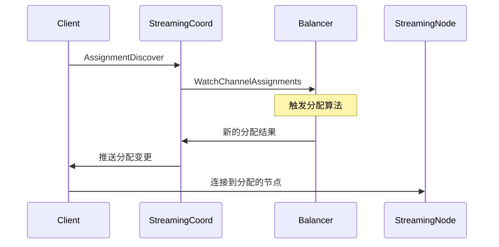

# StreamingCoord 核心架构分析

## 1. 概述

StreamingCoord 是 Milvus 流处理系统的协调器，负责：
- Channel 分配和负载均衡
- 节点管理和服务发现
- 广播服务管理
- 流处理拓扑的维护

## 2. 架构设计

### 2.1 服务器结构

```go
type Server struct {
    logger *log.MLogger
    
    // 会话管理
    session sessionutil.SessionInterface
    
    // 服务层组件
    assignmentService service.AssignmentService  // Channel分配服务
    broadcastService  service.BroadcastService   // 广播服务
    
    // 核心组件
    balancer    *syncutil.Future[balancer.Balancer]      // 负载均衡器
    broadcaster *syncutil.Future[broadcaster.Broadcaster] // 广播器
}
```

### 2.2 初始化流程

```go
func (s *Server) Start(ctx context.Context) error {
    // 1. 初始化基础组件
    s.initBasicComponent(ctx)
    
    // 2. 恢复负载均衡器
    balancer.RecoverBalancer(ctx, newIncomingTopics...)
    
    // 3. 恢复广播器
    broadcaster.RecoverBroadcaster(ctx, registry.GetAppendOperator())
    
    // 4. 注册 gRPC 服务
    s.RegisterGRPCService(grpcServer)
}
```

## 3. 核心组件详解

### 3.1 Balancer（负载均衡器）

#### 3.1.1 接口定义

```go
type Balancer interface {
    // 注册流服务启用通知器
    RegisterStreamingEnabledNotifier(notifier *syncutil.AsyncTaskNotifier[struct{}])
    
    // 获取 WAL 所在节点
    GetLatestWALLocated(ctx context.Context, pchannel string) (int64, bool)
    
    // 监听 Channel 分配变更
    WatchChannelAssignments(ctx context.Context, 
        cb func(version typeutil.VersionInt64Pair, 
               relations []types.PChannelInfoAssigned) error) error
    
    // 标记 Channel 不可用
    MarkAsUnavailable(ctx context.Context, pChannels []types.PChannelInfo) error
    
    // 触发重平衡
    Trigger(ctx context.Context) error
    
    // 关闭负载均衡器
    Close()
}
```

#### 3.1.2 Channel 管理

**PChannelMeta 结构**：
```go
type PChannelMeta struct {
    inner *streamingpb.PChannelMeta
}

// PChannelMeta 包含的信息
type PChannelMeta struct {
    Channel    *PChannelInfo   // Channel 信息
    Node       *NodeInfo       // 分配的节点
    State      PChannelMetaState // 状态
    Histories  []*PChannelAssignmentLog // 历史记录
}
```

**Channel 状态机**：
```
UNINITIALIZED -> ASSIGNING -> ASSIGNED
                     |
                     v
                  UNAVAILABLE
```

#### 3.1.3 负载均衡策略

**VChannel Fair Policy**：
- 基于虚拟 Channel 的公平分配
- 考虑节点容量和当前负载
- 支持亲和性配置
- 动态调整分配

```go
// 策略实现
type vchannel_fair_policy struct {
    expectedLayout   ExpectedLayout
    pchannelAffinity PChannelAffinity
}
```

### 3.2 Broadcaster（广播器）

#### 3.2.1 广播任务管理

```go
type BroadcastTask interface {
    // 任务执行
    Execute(ctx context.Context) error
    
    // 任务回调
    OnAck(result *AppendResult)
    OnCheck(ts Timestamp) error
}
```

#### 3.2.2 广播管理器

```go
type BroadcastManager struct {
    tasks sync.Map // taskID -> BroadcastTask
    appendOperator AppendOperator
}
```

**主要功能**：
- 管理广播任务生命周期
- 处理任务确认和检查
- 支持任务重试机制

### 3.3 Service 层

#### 3.3.1 Assignment Service

负责处理 Channel 分配相关的 RPC 请求：

```go
type AssignmentService interface {
    // 服务发现 - 客户端监听 Channel 分配变更
    AssignmentDiscover(
        server StreamingCoordAssignmentService_AssignmentDiscoverServer,
    ) error
}
```

**工作流程**：
1. 客户端建立长连接
2. 监听 Balancer 的分配变更
3. 推送最新的分配信息给客户端

#### 3.3.2 Broadcast Service

处理广播相关的 RPC 请求：

```go
type BroadcastService interface {
    // 提交广播任务
    SubmitBroadcast(ctx context.Context, 
                   req *BroadcastRequest) (*BroadcastResponse, error)
}
```

### 3.4 Resource 管理

资源管理器统一管理所有依赖：

```go
type Resource struct {
    logger         *log.MLogger
    etcdClient     *clientv3.Client
    streamingCatalog streamingcoord.Catalog
    mixCoordClient types.MixCoordClient
}
```

## 4. Channel 分配机制

### 4.1 分配流程



### 4.2 分配决策因素

1. **节点容量**：CPU、内存、网络带宽
2. **当前负载**：已分配的 Channel 数量
3. **亲和性**：历史分配记录
4. **故障状态**：节点健康状况

### 4.3 重平衡触发条件

- 节点加入/离开集群
- 节点故障检测
- 负载不均衡超过阈值
- 手动触发

## 5. 服务发现机制

### 5.1 Discover Server

```go
type DiscoverServer struct {
    balancer Balancer
    server   AssignmentService_AssignmentDiscoverServer
}
```

**实现细节**：
1. 监听 Balancer 的分配变更
2. 维护客户端连接状态
3. 推送增量更新
4. 处理连接异常

### 5.2 版本控制

使用 `VersionInt64Pair` 进行版本管理：
- 避免客户端接收过期数据
- 支持乐观并发控制
- 实现最终一致性

## 6. 监控和指标

### 6.1 关键指标

```go
// Assignment 监听器数量
StreamingCoordAssignmentListenerTotal

// Channel 分配状态
StreamingCoordChannelAssignmentState

// 负载均衡延迟
StreamingCoordBalancerLatency
```

### 6.2 健康检查

- 定期检查节点存活状态
- 监控 Channel 分配状态
- 跟踪重平衡次数和耗时

## 7. 容错机制

### 7.1 状态持久化

使用 etcd 存储关键状态：
- Channel 分配信息
- 节点状态
- 广播任务

### 7.2 故障恢复

```go
// 恢复负载均衡器
balancer.RecoverBalancer(ctx, topics...)

// 恢复广播器
broadcaster.RecoverBroadcaster(ctx, operator)
```

### 7.3 异常处理

- 节点故障：触发 Channel 重分配
- 网络分区：使用租约机制检测
- 数据不一致：基于版本的冲突解决

## 8. 扩展机制

### 8.1 策略注册

```go
// 注册自定义负载均衡策略
func init() {
    RegisterPolicy("custom", NewCustomPolicy)
}
```

### 8.2 拦截器支持

- 支持在分配前后添加自定义逻辑
- 可用于审计、限流等场景

## 9. 性能优化

### 9.1 并发设计

- 使用 `syncutil.Future` 实现异步初始化
- 并发处理多个客户端连接
- 批量推送分配变更

### 9.2 缓存策略

- 缓存 Channel 分配结果
- 减少 etcd 访问频率
- 使用本地缓存加速查询

## 10. 最佳实践

### 10.1 配置建议

```yaml
streamingCoord:
  balancer:
    checkInterval: 10s      # 健康检查间隔
    rebalanceThreshold: 0.2 # 重平衡阈值
  broadcast:
    maxRetries: 3          # 最大重试次数
    timeout: 30s           # 广播超时
```

### 10.2 运维建议

1. **监控告警**：设置关键指标告警
2. **容量规划**：预留足够的节点容量
3. **版本升级**：使用滚动升级策略
4. **故障演练**：定期进行故障注入测试