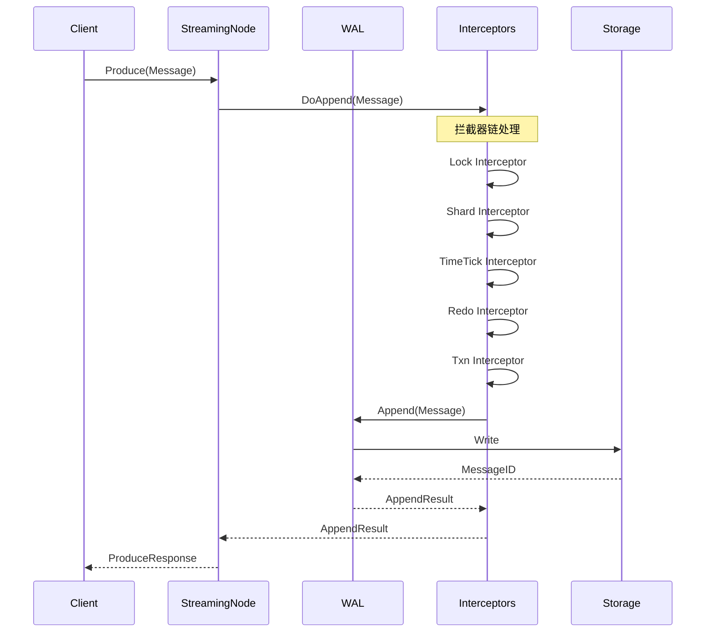
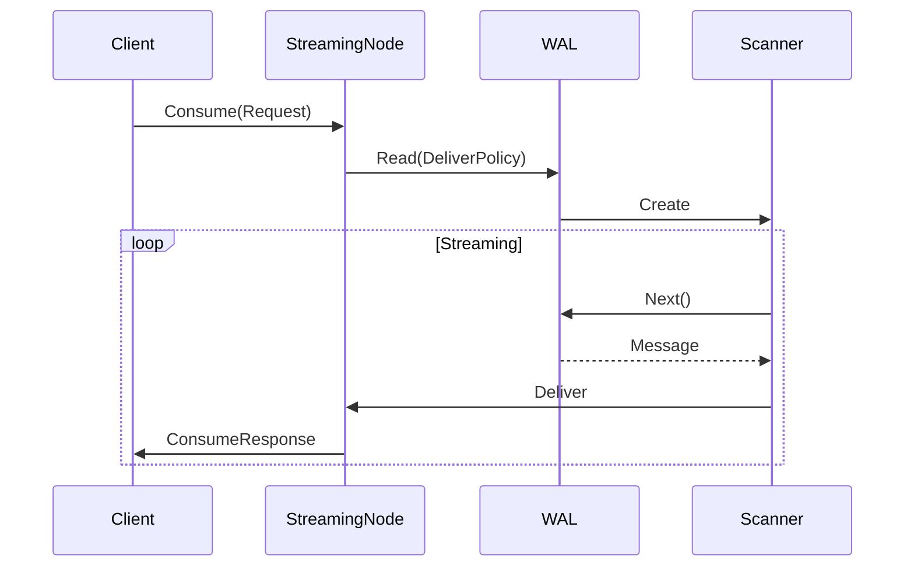

# Milvus Streaming 数据处理流程和消息传递机制

## 1. 概述

Milvus Streaming 服务实现了一个完整的流式数据处理系统，包括：
- 消息的生产、传输和消费
- 基于 WAL 的可靠存储
- 拦截器链式处理
- 时间戳同步机制
- 事务支持

## 2. 消息类型体系

### 2.1 基础消息接口

```go
type Message interface {
    MessageID() MessageID
    MessageType() MessageType
    TimeTick() uint64
    WALTerm() int64
    VChannel() string
    Payload() []byte
}

type MutableMessage interface {
    Message
    WithTimeTick(ts uint64) MutableMessage
    WithWALTerm(term int64) MutableMessage
    WithLastConfirmed(msgID MessageID) MutableMessage
}
```

### 2.2 消息类型分类

1. **控制消息**
   - TimeTickMsg：时间戳同步
   - CreateCollectionMsg：创建集合
   - DropCollectionMsg：删除集合
   - CreatePartitionMsg：创建分区
   - DropPartitionMsg：删除分区

2. **数据消息**
   - InsertMsg：数据插入
   - DeleteMsg：数据删除
   - FlushMsg：数据刷写

3. **事务消息**
   - BeginTxnMsg：开始事务
   - CommitTxnMsg：提交事务
   - RollbackTxnMsg：回滚事务

### 2.3 TimeTick 消息详解

```go
func NewTimeTickMsg(ts uint64, 
                   lastConfirmedMessageID message.MessageID, 
                   sourceID int64, 
                   persist bool) message.MutableMessage {
    b := message.NewTimeTickMessageBuilderV1().
        WithHeader(&message.TimeTickMessageHeader{}).
        WithBody(&msgpb.TimeTickMsg{
            Base: commonpbutil.NewMsgBase(
                commonpbutil.WithMsgType(commonpb.MsgType_TimeTick),
                commonpbutil.WithTimeStamp(ts),
                commonpbutil.WithSourceID(sourceID),
            ),
        }).
        WithAllVChannel()
    
    if !persist {
        b.WithNotPersisted()
    }
    
    msg := b.MustBuildMutable()
    if lastConfirmedMessageID != nil {
        return msg.WithTimeTick(ts).WithLastConfirmed(lastConfirmedMessageID)
    }
    return msg.WithTimeTick(ts).WithLastConfirmedUseMessageID()
}
```

## 3. 数据写入流程

### 3.1 生产者端流程



### 3.2 WAL Append 实现

```go
func (w *walAdaptorImpl) Append(ctx context.Context, 
                               msg message.MutableMessage) (*wal.AppendResult, error) {
    // 1. 生命周期检查
    if !w.lifetime.Add(typeutil.LifetimeStateWorking) {
        return nil, status.NewOnShutdownError("wal is on shutdown")
    }
    defer w.lifetime.Done()
    
    // 2. Fence 检查
    if w.isFenced.Load() {
        return nil, status.NewChannelFenced(w.Channel().String())
    }
    
    // 3. 拦截器就绪检查
    select {
    case <-ctx.Done():
        return nil, ctx.Err()
    case <-w.available.CloseCh():
        return nil, status.NewOnShutdownError("wal is on shutdown")
    case <-w.interceptorBuildResult.Interceptor.Ready():
    }
    
    // 4. 设置 WAL Term
    msg = msg.WithWALTerm(w.Channel().Term)
    
    // 5. 开始度量
    appendMetrics := w.writeMetrics.StartAppend(msg)
    ctx = utility.WithAppendMetricsContext(ctx, appendMetrics)
    
    // 6. 执行拦截器链
    msgID, err := w.interceptorBuildResult.Interceptor.DoAppend(
        ctx, msg, w.rwWALImpls.Append)
    
    // 7. 更新度量
    if err != nil {
        appendMetrics.Fail(err)
        return nil, err
    }
    
    appendMetrics.Ack(msgID)
    return &wal.AppendResult{
        MessageID: msgID,
        TimeTick:  msg.TimeTick(),
        TxnID:     msg.TxnID(),
    }, nil
}
```

### 3.3 拦截器链处理

#### 3.3.1 Lock Interceptor

负责并发控制：

```go
type lockInterceptor struct {
    mu sync.Mutex
}

func (i *lockInterceptor) DoAppend(ctx context.Context, 
                                  msg message.MutableMessage, 
                                  append Append) (message.MessageID, error) {
    i.mu.Lock()
    defer i.mu.Unlock()
    return append(ctx, msg)
}
```

#### 3.3.2 Shard Interceptor

处理分片管理：

```go
func (i *shardInterceptor) DoAppend(ctx context.Context,
                                   msg message.MutableMessage,
                                   append Append) (message.MessageID, error) {
    // 1. 处理 DDL 消息
    if IsDDLMessage(msg) {
        return i.handleDDLMessage(ctx, msg, append)
    }
    
    // 2. 处理 DML 消息
    if IsDMLMessage(msg) {
        return i.handleDMLMessage(ctx, msg, append)
    }
    
    // 3. 其他消息直接传递
    return append(ctx, msg)
}

func (i *shardInterceptor) handleDMLMessage(ctx context.Context,
                                           msg message.MutableMessage,
                                           append Append) (message.MessageID, error) {
    // 获取或创建 Segment
    segment := i.shardManager.GetOrCreateSegment(msg)
    
    // 检查 Segment 限制
    if segment.IsFull() {
        i.shardManager.SealSegment(segment)
        segment = i.shardManager.CreateNewSegment(msg)
    }
    
    // 更新统计信息
    i.statsManager.UpdateStats(msg)
    
    return append(ctx, msg)
}
```

#### 3.3.3 TimeTick Interceptor

管理时间戳同步：

```go
func (i *timeTickInterceptor) DoAppend(ctx context.Context,
                                      msg message.MutableMessage,
                                      append Append) (message.MessageID, error) {
    // 1. 获取当前 MVCC 时间戳
    currentMVCC := i.mvccManager.GetMVCCOfVChannel(msg.VChannel())
    
    // 2. 分配时间戳
    if msg.TimeTick() == 0 {
        ts := i.allocateTimestamp()
        msg = msg.WithTimeTick(ts)
    }
    
    // 3. 更新 MVCC
    i.mvccManager.UpdateMVCCTimestamp(msg.VChannel(), msg.TimeTick())
    
    // 4. 触发时间戳同步
    if i.shouldSyncTimeTick() {
        i.triggerTimeTickSync()
    }
    
    return append(ctx, msg)
}
```

## 4. 数据读取流程

### 4.1 消费者端流程



### 4.2 Scanner 实现

```go
type Scanner interface {
    // 获取下一条消息
    Next(ctx context.Context) (message.ImmutableMessage, error)
    
    // 关闭扫描器
    Close()
}

type scannerImpl struct {
    walReader   WALReader
    deliverFilter DeliverFilter
    reorderBuffer *ReorderBuffer
}

func (s *scannerImpl) Next(ctx context.Context) (message.ImmutableMessage, error) {
    for {
        // 1. 从 WAL 读取消息
        msg, err := s.walReader.Read(ctx)
        if err != nil {
            return nil, err
        }
        
        // 2. 应用过滤器
        if !s.deliverFilter.Filter(msg) {
            continue
        }
        
        // 3. 重排序缓冲
        s.reorderBuffer.Push(msg)
        
        // 4. 获取有序消息
        if orderedMsg := s.reorderBuffer.Pop(); orderedMsg != nil {
            return orderedMsg, nil
        }
    }
}
```

### 4.3 传递策略

```go
type DeliverPolicy interface {
    Policy() DeliverPolicyType
    MessageID() message.MessageID
    TimeTick() uint64
}

// 从最早消息开始
type DeliverPolicyAll struct{}

// 从指定消息开始
type DeliverPolicyStartFrom struct {
    messageID message.MessageID
}

// 从指定时间戳开始
type DeliverPolicyStartAfter struct {
    timeTick uint64
}

// 只读取最新消息
type DeliverPolicyLatest struct{}
```

## 5. 消息刷写机制

### 5.1 Flusher 架构

```go
type WALFlusher struct {
    vchannel        string
    scanner         wal.Scanner
    msgHandler      MessageHandler
    segmentManager  SegmentManager
    dataCoordClient DataCoordClient
}

func (f *WALFlusher) Start(ctx context.Context) {
    for {
        select {
        case <-ctx.Done():
            return
        default:
            msg, err := f.scanner.Next(ctx)
            if err != nil {
                continue
            }
            
            // 处理消息
            if err := f.handleMessage(ctx, msg); err != nil {
                log.Warn("handle message failed", zap.Error(err))
            }
        }
    }
}
```

### 5.2 消息处理流程

```go
func (f *WALFlusher) handleMessage(ctx context.Context, 
                                  msg message.ImmutableMessage) error {
    switch msg.MessageType() {
    case message.MessageTypeInsert:
        return f.msgHandler.HandleInsert(ctx, msg.(*InsertMessage))
    case message.MessageTypeDelete:
        return f.msgHandler.HandleDelete(ctx, msg.(*DeleteMessage))
    case message.MessageTypeCreateCollection:
        return f.msgHandler.HandleCreateCollection(ctx, msg.(*CreateCollectionMessage))
    case message.MessageTypeDropCollection:
        return f.msgHandler.HandleDropCollection(ctx, msg.(*DropCollectionMessage))
    case message.MessageTypeFlush:
        return f.handleFlush(ctx, msg.(*FlushMessage))
    default:
        return nil
    }
}
```

### 5.3 数据累积与刷写

```go
func (h *msgHandlerImpl) HandleInsert(ctx context.Context, 
                                     msg *InsertMessage) error {
    // 1. 获取 Segment
    segment := h.segmentManager.GetSegment(msg.SegmentID)
    if segment == nil {
        segment = h.segmentManager.CreateSegment(msg.SegmentID)
    }
    
    // 2. 插入数据
    if err := segment.Insert(msg.Data); err != nil {
        return err
    }
    
    // 3. 检查刷写条件
    if h.shouldFlush(segment) {
        return h.flushSegment(ctx, segment)
    }
    
    return nil
}

func (h *msgHandlerImpl) shouldFlush(segment Segment) bool {
    // 基于大小
    if segment.Size() >= h.maxSegmentSize {
        return true
    }
    
    // 基于行数
    if segment.RowCount() >= h.maxRowCount {
        return true
    }
    
    // 基于时间
    if time.Since(segment.CreateTime()) >= h.flushInterval {
        return true
    }
    
    return false
}
```

## 6. 时间戳同步机制

### 6.1 MVCC 管理

```go
type MVCCManager interface {
    // 获取 VChannel 的 MVCC 信息
    GetMVCCOfVChannel(vchannel string) MVCCInfo
    
    // 更新 MVCC 时间戳
    UpdateMVCCTimestamp(vchannel string, ts uint64)
}

type MVCCInfo struct {
    VChannel  string
    Timetick  uint64
    Confirmed bool
}
```

### 6.2 时间戳同步流程

```go
type TimeTickSyncOperator struct {
    mvccManager MVCCManager
    inspector   TimeTickInspector
    ackManager  AckManager
}

func (o *TimeTickSyncOperator) Sync(ctx context.Context) error {
    // 1. 获取所有 VChannel
    vchannels := o.mvccManager.GetAllVChannels()
    
    for _, vchannel := range vchannels {
        // 2. 获取最小未确认时间戳
        minUnconfirmed := o.ackManager.GetMinUnconfirmedTimestamp(vchannel)
        
        // 3. 更新 MVCC
        o.mvccManager.UpdateMVCCTimestamp(vchannel, minUnconfirmed)
        
        // 4. 发送 TimeTick 消息
        if o.shouldSendTimeTick(vchannel) {
            o.sendTimeTickMessage(ctx, vchannel, minUnconfirmed)
        }
    }
    
    return nil
}
```

## 7. 事务支持

### 7.1 事务消息流程

```go
// 开始事务
func BeginTransaction(ctx context.Context, txnID string) error {
    msg := NewBeginTxnMessage(txnID)
    _, err := wal.Append(ctx, msg)
    return err
}

// 提交事务
func CommitTransaction(ctx context.Context, txnID string) error {
    msg := NewCommitTxnMessage(txnID)
    _, err := wal.Append(ctx, msg)
    return err
}

// 回滚事务
func RollbackTransaction(ctx context.Context, txnID string) error {
    msg := NewRollbackTxnMessage(txnID)
    _, err := wal.Append(ctx, msg)
    return err
}
```

### 7.2 事务拦截器

```go
func (i *txnInterceptor) DoAppend(ctx context.Context,
                                 msg message.MutableMessage,
                                 append Append) (message.MessageID, error) {
    // 1. 检查事务状态
    if msg.TxnID() != "" {
        session := i.txnManager.GetSession(msg.TxnID())
        if session == nil {
            return nil, errors.New("transaction not found")
        }
        
        if session.State != TxnStateActive {
            return nil, errors.New("transaction not active")
        }
    }
    
    // 2. 执行追加
    msgID, err := append(ctx, msg)
    if err != nil {
        return nil, err
    }
    
    // 3. 更新事务
    if msg.TxnID() != "" {
        i.txnManager.AddOperation(msg.TxnID(), msgID)
    }
    
    return msgID, nil
}
```

## 8. 性能优化

### 8.1 批量处理

```go
type BatchAppender struct {
    wal         WAL
    batchSize   int
    flushPeriod time.Duration
    buffer      []message.MutableMessage
    mu          sync.Mutex
}

func (b *BatchAppender) Append(msg message.MutableMessage) error {
    b.mu.Lock()
    b.buffer = append(b.buffer, msg)
    
    if len(b.buffer) >= b.batchSize {
        defer b.mu.Unlock()
        return b.flush()
    }
    
    b.mu.Unlock()
    return nil
}

func (b *BatchAppender) flush() error {
    if len(b.buffer) == 0 {
        return nil
    }
    
    // 批量追加
    for _, msg := range b.buffer {
        if _, err := b.wal.Append(context.Background(), msg); err != nil {
            return err
        }
    }
    
    b.buffer = b.buffer[:0]
    return nil
}
```

### 8.2 并行消费

```go
type ParallelConsumer struct {
    scanner     wal.Scanner
    workerCount int
    msgChan     chan message.ImmutableMessage
}

func (c *ParallelConsumer) Start(ctx context.Context) {
    // 启动工作协程
    for i := 0; i < c.workerCount; i++ {
        go c.worker(ctx)
    }
    
    // 读取消息
    go func() {
        for {
            msg, err := c.scanner.Next(ctx)
            if err != nil {
                close(c.msgChan)
                return
            }
            c.msgChan <- msg
        }
    }()
}

func (c *ParallelConsumer) worker(ctx context.Context) {
    for msg := range c.msgChan {
        // 处理消息
        c.processMessage(ctx, msg)
    }
}
```

## 9. 监控指标

### 9.1 写入指标

- 消息追加延迟
- 消息大小分布
- 吞吐量（消息/秒，字节/秒）
- 拦截器处理时间

### 9.2 读取指标

- 扫描延迟
- 消息传递延迟
- 消费速率
- 积压消息数

### 9.3 同步指标

- TimeTick 延迟
- MVCC 更新频率
- 未确认消息数

## 10. 错误处理

### 10.1 重试机制

```go
func AppendWithRetry(ctx context.Context, wal WAL, 
                    msg message.MutableMessage) (*AppendResult, error) {
    return retry.Do(ctx, func() (*AppendResult, error) {
        return wal.Append(ctx, msg)
    }, retry.Attempts(3), retry.Sleep(time.Second))
}
```

### 10.2 降级策略

- WAL 不可用时缓存到本地
- 网络故障时批量重传
- 存储满时触发强制刷写